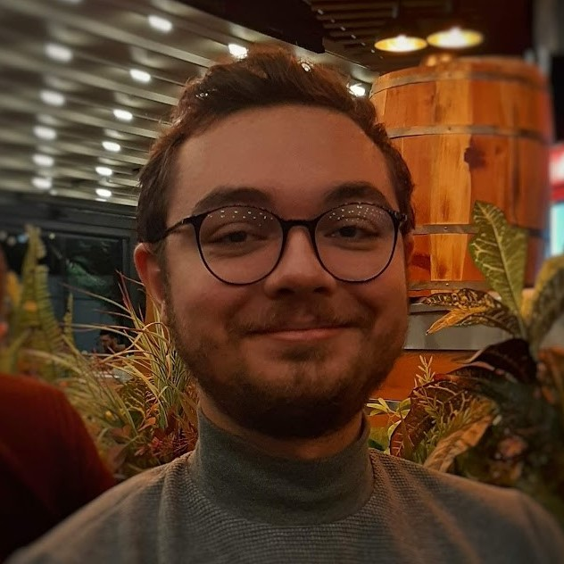

# Hello! 👋
  I am **Bahri Batuhan Bilecen**, a junior research engineer at [ASELSAN Research](https://www.aselsan.com.tr/en), MSc student at [Bilkent University](https://w3.bilkent.edu.tr/bilkent/)'s computer engineering department, and electrical-electronics engineering graduate at [Middle East Technical University](https://www.metu.edu.tr/). 

### Research

During my undergraduate studies, I worked as a part-time engineer and engineering intern at [STM](https://www.stm.com.tr/en), [ASELSAN](https://www.aselsan.com.tr/en), and [METU Center for Image Analysis (OGAM)](http://ogam.metu.edu.tr/en/). I primarily focused on computer architecture, signal processing, and computer vision.
My research at OGAM was centered around optical flow algorithms on event-based vision, under the supervision of [Prof. A. Aydın Alatan](https://scholar.google.com/citations?user=h6mCaBoAAAAJ&hl=en). I participated in national & international competitions and designed autonomous unmanned aerial vehicles, at [Prof. Kemal Leblebicioğlu](https://scholar.google.com.tr/citations?user=Uh3W5WsAAAAJ&hl=tr)'s control lab.

My MSc is focused on image enhancement with deep generative networks, under the supervision of [Asst. Prof. Ayşegül Dündar](http://www.cs.bilkent.edu.tr/~adundar/). My current research interests are low-level computer vision for image enhancement, event-based vision, deep generative networks, and neural network optimization. 

### Publications
