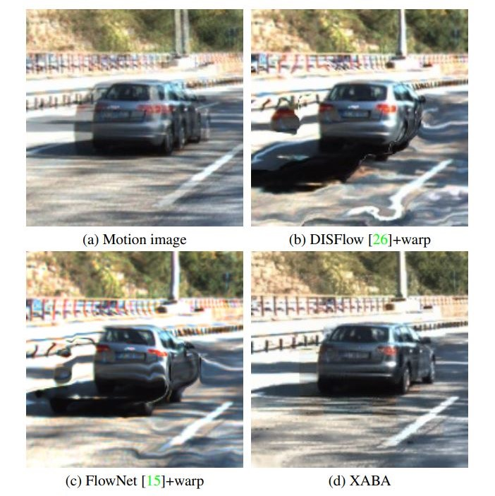
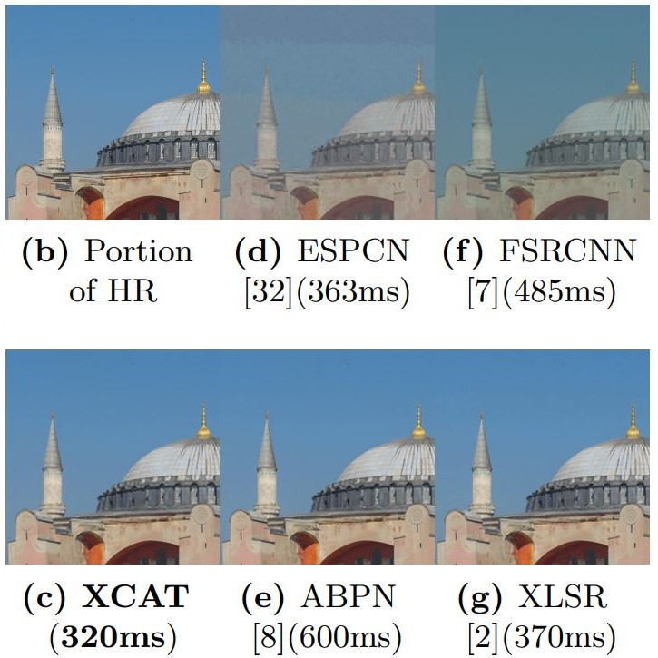

# Hello! 👋
  I am **Bahri Batuhan Bilecen**, a junior research engineer at [ASELSAN Research](https://www.aselsan.com.tr/en), MSc student at [Bilkent University](https://w3.bilkent.edu.tr/bilkent/)'s computer engineering department, and electrical-electronics engineering graduate at [Middle East Technical University](https://www.metu.edu.tr/). 

### Research 📚

During my undergraduate studies, I worked as a part-time engineer and engineering intern at [STM](https://www.stm.com.tr/en), [ASELSAN](https://www.aselsan.com.tr/en), and [METU Center for Image Analysis (OGAM)](http://ogam.metu.edu.tr/en/). I primarily focused on computer architecture, signal processing, and computer vision.
My research at OGAM was centered around optical flow algorithms on event-based vision, under the supervision of [Prof. A. Aydın Alatan](https://scholar.google.com/citations?user=h6mCaBoAAAAJ&hl=en). I participated in national & international competitions and designed autonomous unmanned aerial vehicles, at [Prof. Kemal Leblebicioğlu](https://scholar.google.com.tr/citations?user=Uh3W5WsAAAAJ&hl=tr)'s control lab.

My MSc is focused on image enhancement with deep generative networks, under the supervision of [Asst. Prof. Ayşegül Dündar](http://www.cs.bilkent.edu.tr/~adundar/). My current research interests are low-level computer vision for image enhancement, event-based vision, deep generative networks, and neural network optimization. 

### Publications 📑

|       |  |
| ----------- | ----------- |
|      | *Efficient Multi-Purpose Cross-Attention Based Image Alignment Block for Edge Devices*   **Bahri Batuhan Bilecen**, Alparslan Fişne, Mustafa Ayazoğlu   IEEE/CVF CVPR 2022 Embedded Vision Workshop   [Paper](https://openaccess.thecvf.com/content/CVPR2022W/EVW/papers/Bilecen_Efficient_Multi-Purpose_Cross-Attention_Based_Image_Alignment_Block_for_Edge_Devices_CVPRW_2022_paper.pdf)   [Presentation](https://youtu.be/gOQ_q7-sCNM)   |
|    | *XCAT - Lightweight Quantized Single Image Super-Resolution using Heterogeneous Group Convolutions and Cross Concatenation*   Mustafa Ayazoğlu, **Bahri Batuhan Bilecen**   ECCV 2022 Advances in Image Manipulation (AIM) Workshop   [Paper](https://arxiv.org/pdf/2208.14655.pdf)   [Presentation](https://youtu.be/5IEqenmxEpg)     |

### Contact ✉️

